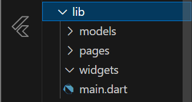
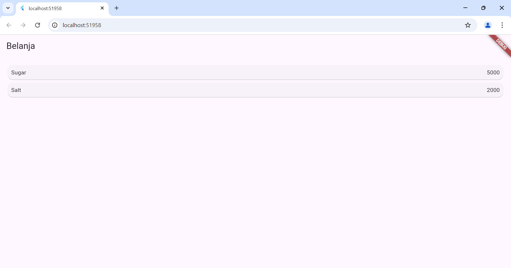
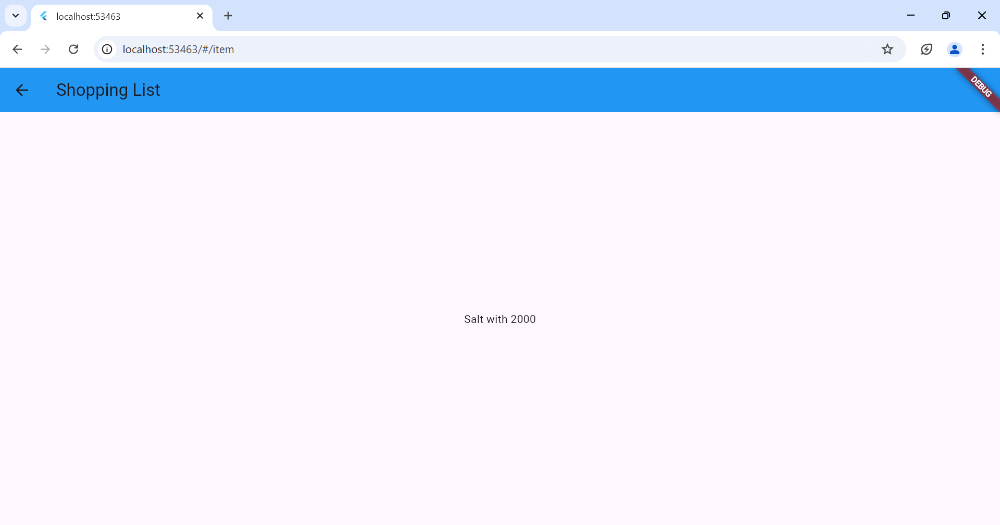
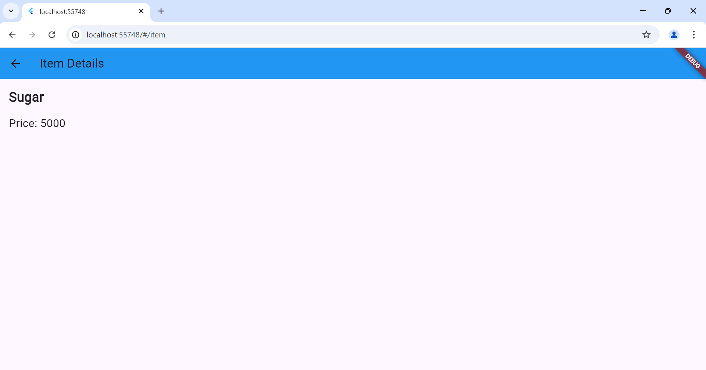
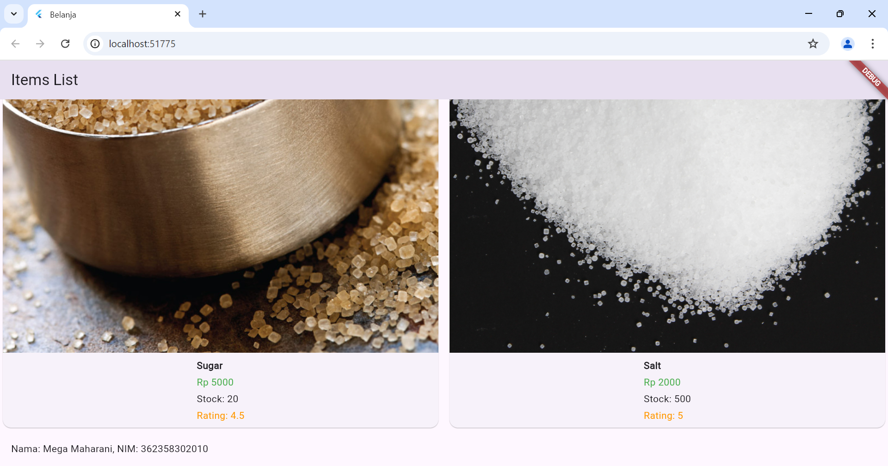

# belanja

A new Flutter project.

## Getting Started

Praktikum 5: Membangun Navigasi di Flutter
Langkah 1: Siapkan project baru dengan nama belanja, kemudian susun folder seperti gambar dibawah:

Langkah 2: Definisikan route
buatlah file dengan nama home_page.dart dan item_page.dart dan deklarasikan serta turunkan class dari StatelessWidget.

Langkah 3: Tambahkan initialRoute dalam main.dart

Langkah 4: Membuat data model, dengan file nama item.dart dan definisikan 

Langkah 5: Melengkapi kode di class homepage, yang terdapat listview widget 

Langkah 6: Membuat ListView dan itemBuilder

Langkah 7: Menambahkan aksi pada ListView

Tugas Praktikum 2:
1.Pengiriman data ke halaman berikutnya bisa menggunakan navigator.
2.Pembacaan nilai pada halaman sebelumnya bisa menggunakan ModalRoute dan tambahkan kode pada fungsi build di halaman itempage
3.Tambahkan foto produk, stok dan rating, kemudian rubah menjadi GridView

4.Tambahkan nama dan nim, di footer